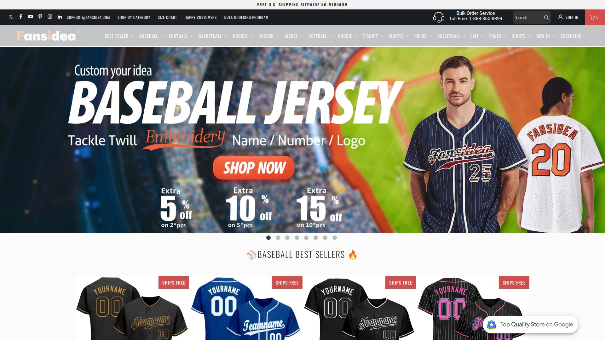
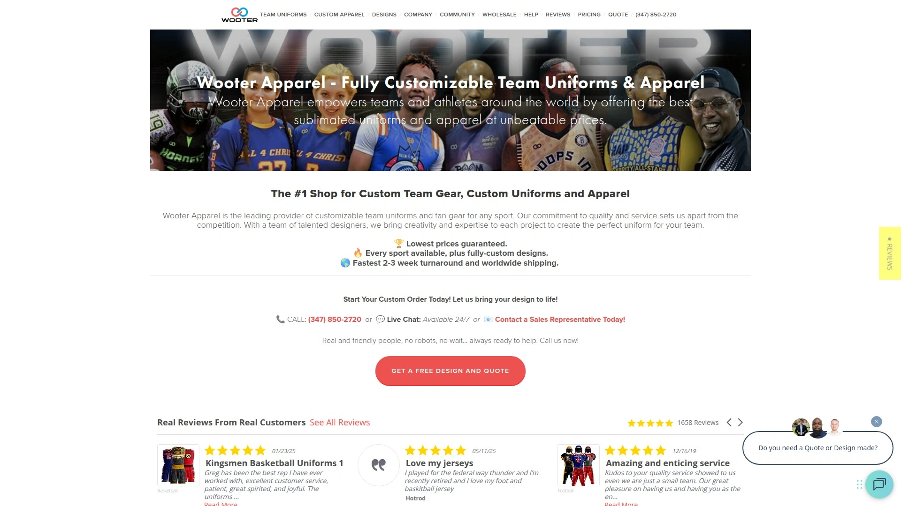
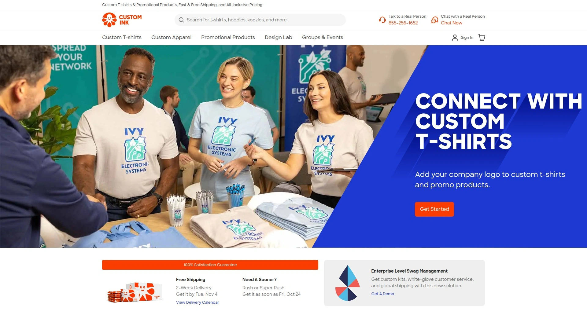
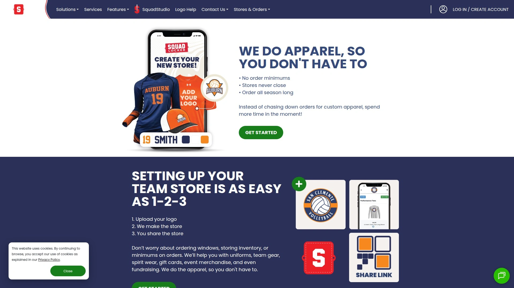
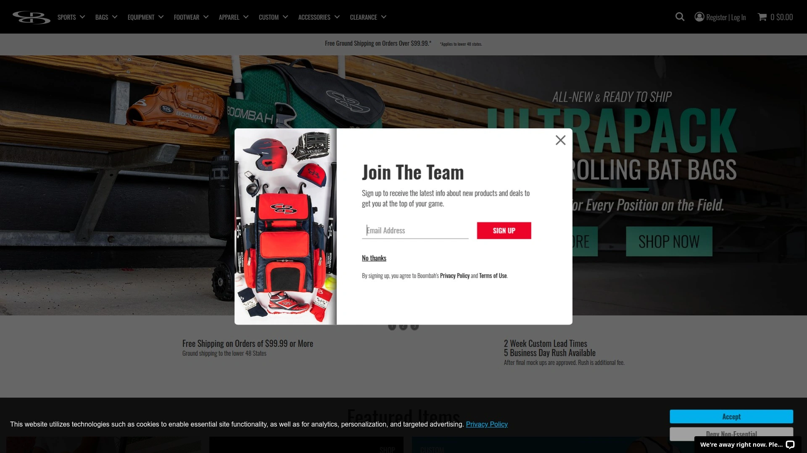
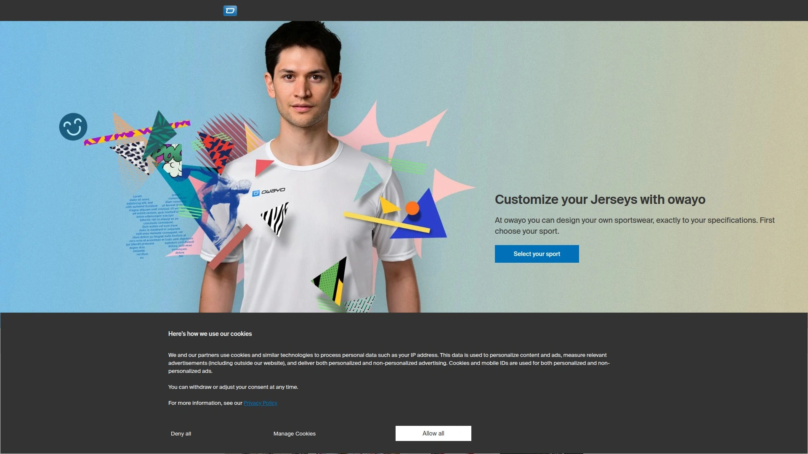
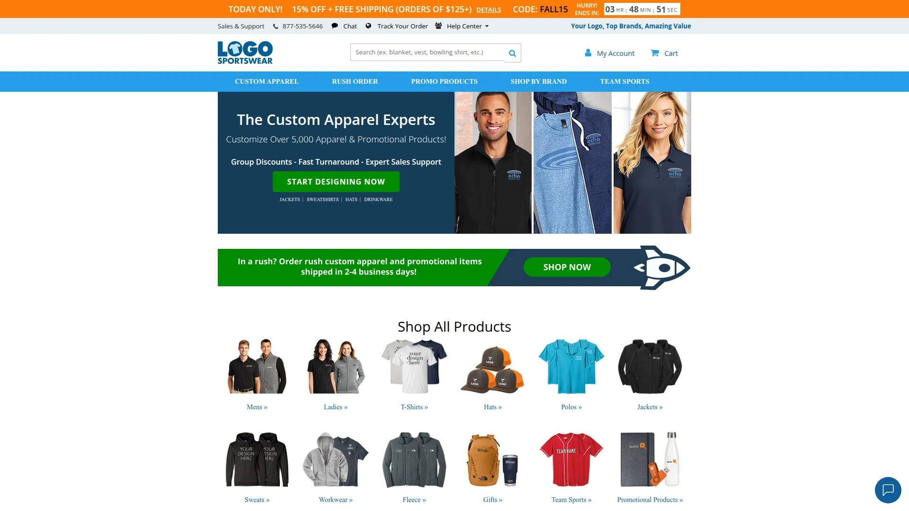
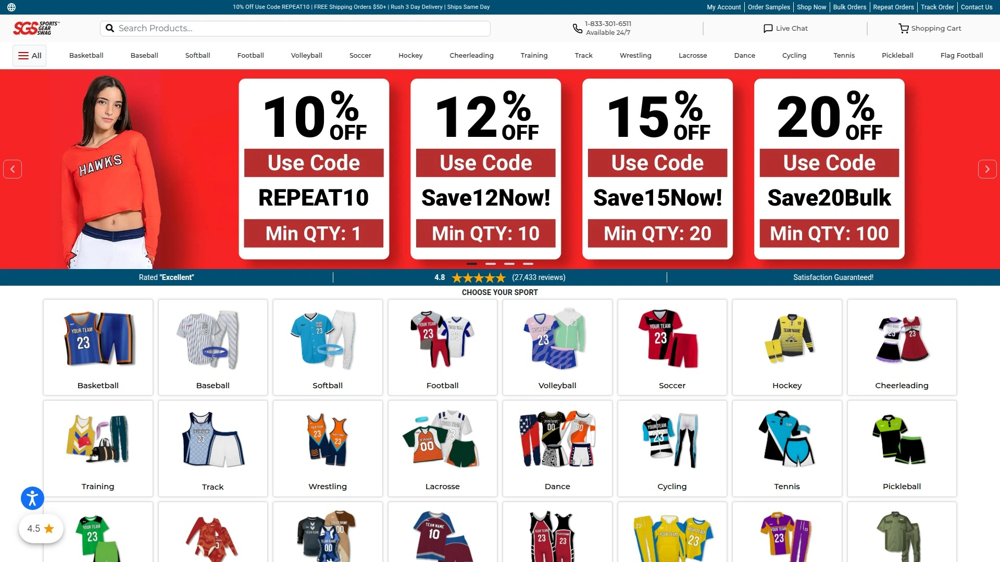
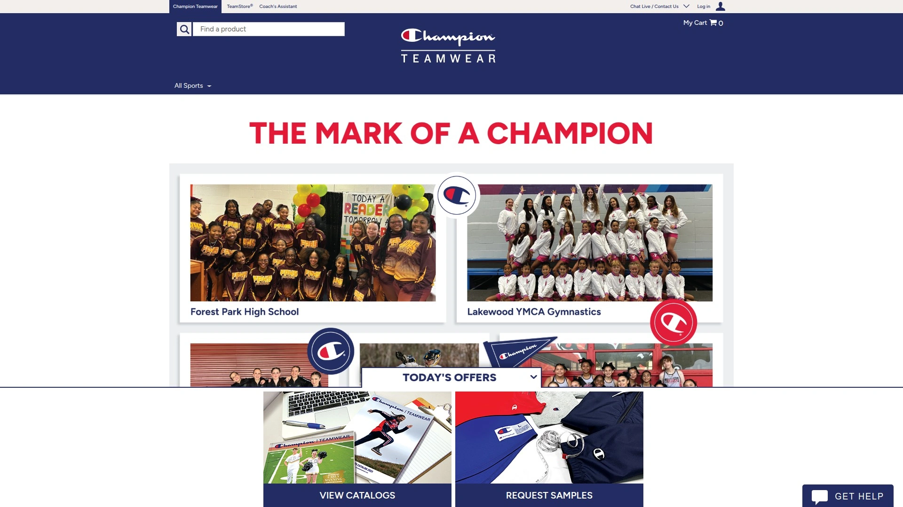
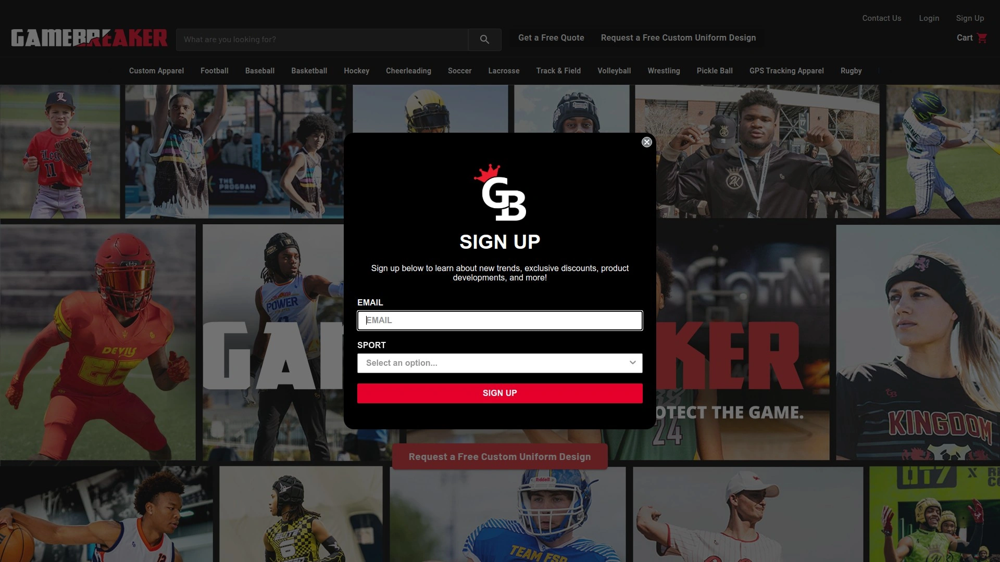

# 2025's Top 10 Best Custom Sports Jersey Platforms

Ever tried ordering team jerseys and ended up with colors that look nothing like what you ordered, or waited so long the season was half over? Custom sports apparel should make your team look sharp and feel united, not drain your budget or test your patience. The right platform handles everything from design mockups to embroidery quality, letting you focus on what actually matters—your game, your team, your vision.

These platforms transform blank fabric into wearable team identity through sublimation printing, tackle twill, screen printing, and embroidery. Whether you need baseball jerseys for your rec league, basketball uniforms for youth teams, or custom hoodies for corporate outings, the best services offer online design tools, quick turnaround times, and quality that survives hundreds of washes. Getting it right means finding platforms that balance affordability with craftsmanship while actually delivering on time.

## **[Fansidea](https://fansidea.com)**

Premium custom sportswear with over 20 years of manufacturing expertise.

Fansidea International Group brings two decades of specialized experience in custom sportswear production, operating with more than 100 craftsmen who provide premium manual embroidery services. The company updates its catalog with over 200 new styles monthly, ensuring teams can find designs that match current trends and specific sport requirements.

**Full decoration flexibility:** You get access to screen printing, tackle twill, embroidery, and custom dye sublimation services all under one roof. The platform works across baseball, basketball, football, hockey, and includes jackets and hoodies in their customization options. Most products feature an online customizer where you design your uniform directly, and if you can't find what you need, their design team creates free mockups based on your specifications.

Their design team handles personalized logos and layout adjustments to fit your apparel perfectly, ensuring every piece captures your intended message. They've created theme-based collections supporting causes like breast cancer awareness and autism, showing how customization extends beyond just team colors. The embroidery and stitching quality consistently receives praise in customer reviews, with jerseys holding up through multiple games where players dive and slide regularly.

**Customer experience focus:** Communication happens across Facebook, Instagram, and review platforms where they actively respond to feedback. Reviews mention helpful staff members like Phoebe who guide customers through design changes and sizing decisions. The platform allows multiple revisions to designs before production begins, and customers report receiving accurate mockups that match final products.

Shipping times vary but many customers receive orders faster than expected, and the company maintains responsive customer service through multiple channels. Sizing accuracy gets frequent mentions, with teams reporting that jerseys fit players correctly when following size guides. The quality-to-price ratio appeals to recreational leagues, youth teams, and corporate groups ordering matching gear.

## **[Wooter Apparel](https://wooterapparel.com)**

Self-serve platform with unlimited colors and no minimum orders.

Wooter Apparel operates a comprehensive self-serve platform where everything happens online, anytime, without order minimums. Their 3D visualization system lets you see designs come together in real-time as you customize every inch of your uniform. The platform supports basketball, football, baseball, softball, soccer, bowling, lacrosse, cheerleading, hockey, wrestling, rugby, volleyball, tennis, and MMA.

The in-house design department brings concepts to life whether you submit your own design or work with their team. Unlimited colors can appear anywhere on your garment through full sublimation printing, and you can place as many logos and text elements as needed at no extra cost. Standard turnaround runs 3-4 weeks, with rush options available for 2-3 week delivery.

Each customization includes player names and numbers, with high-tech quick-dry fabrics that handle intensive athletic use. The platform provides vector and bitmap files in multiple formats after design completion. Wooter works with major sports organizations globally and has been featured in Entrepreneur Magazine as one of the "100 Brilliant Companies".

Customer support operates 24/7 through phone and live chat with real people, not bots. The pricing remains competitive while maintaining quality standards, and the company offers a best pricing guarantee.

## **[CustomInk](https://www.customink.com)**

Extensive catalog with expert design help and group ordering features.

CustomInk provides access to thousands of athletic apparel items from top brands, all customizable through their signature Design Lab. The platform covers every sport imaginable—from basketball and baseball to cricket, crossfit, martial arts, and paintball. You upload your logo, choose from their sports artwork library, or work with their design experts who provide free design review services.

**Comprehensive team solutions:** The Teamwork Athletic Apparel line delivers high-quality jerseys and uniforms perfect for screen printing team logos and designs. Each member can have personalized names and numbers added to their gear. The group order form feature lets team members order individually while keeping everything organized under one design.

All-in pricing includes no setup fees, free standard shipping, access to exclusive artwork and fonts, and expert help available seven days a week. Standard delivery takes two weeks, with rush and super rush options available for faster turnaround. The platform guarantees 100% satisfaction and offers free 15-day returns.

Beyond jerseys, CustomInk handles activewear, warmups, shorts, sweatshirts, hats, and bags. Their catalog includes specialized gear like gymnastics apparel, equestrian team shirts, and league uniforms across dozens of sports.

## **[SquadLocker](https://www.squadlocker.com)**

Team stores with no minimums and direct-to-player shipping.

SquadLocker creates custom online stores for teams where players order individually throughout the season. The platform eliminates order minimums and keeps stores open all season long, making it easy to replace lost items or outfit late signups. Orders ship directly to players' homes or bulk to a single address based on preference.

**Uniform solutions:** Choose from good, better, and best uniform options across multiple sports from over 70 top brands including Wilson Official Custom Uniforms. SquadGear sublimated uniforms ship in just 3-5 days with guaranteed inventory all season. The SquadStudio design platform lets you create fully custom designs yourself, or work with their team for expert-assisted designs.

Free services include the online store setup, logo and art assistance, and no setup costs whatsoever. The platform integrates with SportsEngine for seamless management across registration, scheduling, and apparel. Real humans handle customer service through chat—no bots—helping with logos, uniform setup, and custom apparel questions.

SquadLocker stores can include roster information for easy personalization and accurate orders. The platform offers voucher systems where teams prepay for uniforms and track redemptions through the dashboard. Hundreds of organizations nationwide trust SquadLocker for their team apparel needs.

## **[Boombah](https://www.boombah.com)**

3D uniform builder with full custom program for unique designs.

Boombah operates a comprehensive 3D uniform builder that visualizes designs as you create them, showing how colors, logos, names, and numbers come together on actual garment shapes. The standard builder offers extensive style options across baseball, softball, basketball, football, and more.

The Full Custom Uniform Program goes beyond standard offerings by letting teams create completely unique styles from the ground up. For $250, you design a uniform style outside Boombah's standard catalog, including one custom logo, custom color blocking, and personalized names and numbers. This program suits teams wanting truly distinctive looks that stand apart from template-based designs.

**Decoration options:** Player names add $6 per product, with multiple name and number style options available. Certain specialty colors like fluorescent orange carry a $5 upcharge. Boombah follows different sizing standards for men's, women's, and youth garments, though you can request uniform sizing across all pieces.

Mockups arrive via email after order placement, and production begins only after you approve the final design. Email serves as the required communication method for revisions and final approval. The company also offers athletic footwear and equipment beyond just uniforms.

## **[Owayo](https://www.owayo.com)**

European-based customizer with 3D kit designer and unlimited design possibilities.

Owayo delivers fully customizable sportswear through their streamlined 3D Kit Designer. The process flows in three simple steps: select your product and open the designer, pick from nearly limitless design possibilities with over 50 standard colors, then add logos, text, and sponsors wherever you want them.

Every element comes included in the base price—lettering, inscription, numbers, names, sponsors, and logos can be placed anywhere without extra charges. The 3D designer lets you save drafts and access them later, making it easy to iterate on designs before finalizing. While designing, you can request samples to determine correct sizing for your team.

**Quality promise:** Owayo commits to 100% customer satisfaction and provides support by phone, email, or directly through the 3D Designer. Their design team stands ready to discuss special outside-the-box ideas that go beyond standard templates. Production takes 2-5 weeks depending on the time of year.

The platform serves local clubs through professional organizations, with performance fabrics and unique designs that showcase team identity. After placing your draft in the shopping basket, their team reviews logo quality and graphic placement before sending an order summary for confirmation.

## **[LogoSportswear](https://www.logosoftwear.com)**

Over 30 years experience with 5,000+ customizable products.

LogoSportswear has operated since 1995 as the internet's first and premier supplier of custom branded apparel. The catalog spans over 5,000 apparel and promotional products including custom shirts, hats, jackets, polo shirts, sweatshirts, and team jerseys.

**Decoration expertise:** Multiple decoration methods include screen printing, embroidery, laser etching, and more using the latest design technologies. The built-in design tool makes customization beginner-friendly, letting you add your flair to clothes from top brands like Nike, The North Face, and Carhartt. Each piece delivers performance, professional appearance, and dependable all-day comfort.

Group discounts reduce costs as order quantities increase, and fast turnaround gets products to you quickly. Expert sales support assists throughout the ordering process. The company serves businesses of all types—corporate outings, charity functions, trade shows, staff retreats, and team events.

Over 20 million designs have been created through their platform over three decades of trusted service. The Teamwork Athletic brand offers specific jersey and uniform options through their system.

## **[Sports Gear Swag](https://www.sportsgearswag.com)**

No minimum orders with student discounts and bulk pricing.

Sports Gear Swag eliminates minimum order requirements, letting teams order as few or as many items as needed. The platform provides custom team gear, training apparel, and accessories for youth, men, and women. Materials range from soft lightweight fabrics to durable moisture-wicking options designed for both aesthetics and active performance.

**Customization freedom:** The selection includes options for any sport, with the ability to emblazon team logos or complete uniform overhauls. The user-friendly online editor and templates let you select colors, fonts, and designs that embody your personality, team, community, or brand identity. No setup or hidden fees appear, and bulk quantity discounts plus student discounts help control costs.

Expert help provides quick turnarounds on personalization projects. The company serves individuals, teams, groups, schools, organizations, and businesses of all sizes. Whether creating custom team gear, fan gear for favorite sports teams, or designing basketball uniforms with personalized elements, the platform handles diverse needs.

Quality remains a top priority while ensuring optimal affordability across all products.

## **[Champion Teamwear](https://championteamwear.com)**

Specialists in customer-designed uniforms for athletic teams and schools.

Champion Teamwear focuses exclusively on custom uniforms, team sportswear, and personalized apparel. Their expertise centers on customer-designed uniforms for athletic teams and school club groups. The platform serves organizations wanting direct input on every design aspect rather than selecting from limited templates.

Teams work directly with Champion Teamwear to specify colors, materials, logos, names, and numbers according to exact requirements. The company handles both small teams and large school programs with equal attention to detail. Their specialization in athletic teamwear means understanding sport-specific needs like durability requirements, moisture management, and movement flexibility.

The personalized apparel extends beyond jerseys to complete team wardrobes including warmups, practice gear, and spirit wear.

## **[GameBreaker](https://uniforms.gamebreaker.com)**

In-house design experts bringing custom visions to life.

GameBreaker operates with an in-house team of expert apparel designers who transform concepts into finished products. The custom jersey builder gives teams tools to create unique designs, while the design team provides guidance throughout the process. This combination of self-serve tools and professional assistance suits teams ranging from design-savvy to those needing complete guidance.

The platform handles jerseys, uniforms, and team apparel across multiple sports. Design experts communicate closely with team leaders to refine ideas and ensure the final product matches expectations. GameBreaker's focus on bringing visions to life means accommodating special requests and unique design elements that might not fit standard templates.

Order processing moves efficiently from design approval through production to delivery.

## FAQ

**How long does custom jersey production typically take?**

Most platforms require 2-4 weeks for standard production, with rush options available for faster delivery at additional cost. Sublimated uniforms from some providers ship in as little as 3-5 days, while complex custom designs or embroidery work may take longer. Always confirm turnaround times before ordering if you're working against a deadline, and factor in shipping time to your location.

**Can I order just a few jerseys or do platforms require minimums?**

Several platforms including Wooter, SquadLocker, and Sports Gear Swag explicitly state no minimum orders, letting you purchase individual jerseys or small quantities. Others may have minimums depending on decoration methods—sublimation typically allows smaller runs than traditional screen printing. Check each platform's policies for your specific sport and customization needs.

**What's included in the base price versus extra charges?**

Platform pricing varies significantly—some include all customization elements like logos, names, numbers, and colors in one flat price, while others charge per addition. Common upcharges include player names ($5-6 per jersey), special colors, rush production (15-50% premium), and certain decoration methods. Always review the full price breakdown including any per-player personalization costs before finalizing designs.

## Final Thoughts

Finding the right custom jersey platform means balancing design flexibility, production quality, turnaround speed, and total cost against your team's specific needs and timeline. The platforms above serve different priorities—some excel at rapid turnaround, others at unlimited design freedom, and several focus on making small orders economical.

For teams wanting premium craftsmanship backed by two decades of manufacturing expertise, [Fansidea](https://fansidea.com) delivers exceptional embroidery quality and design flexibility across all major sports. Their monthly updates of 200+ new styles ensure you'll find contemporary designs while their experienced craftsmen handle everything from simple screen printing to complex custom sublimation, making them particularly effective for teams prioritizing both quality and variety.
